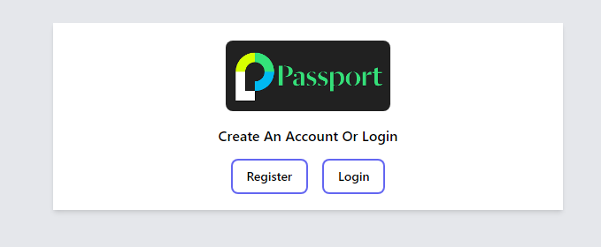
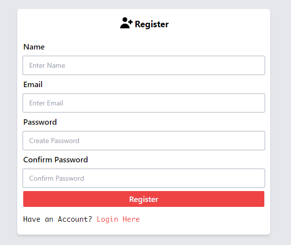
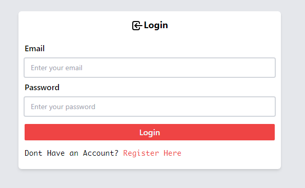

## This is a passport js web based authentication app.

---

To use the project ensure to add a srv connection string to your **mongo db** for a connection in a `config.env` file see below👇🏽👇🏽.

`MONGOOSE_URL = mongodb+srv://<username>:<password>@<*connection*>/passport-authentication?retryWrites=true&w=majority`

The following images represent the project:

